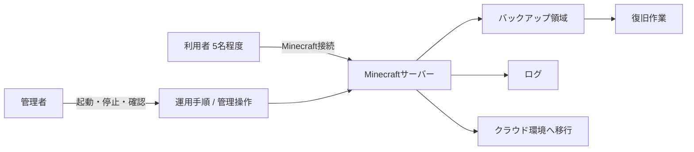

# 基本設計書

## 1. 文書の目的
本書は、Minecraftサーバー構築・運用・クラウド移行プロジェクトの基本設計を定義する。要件定義書で定めた内容を受けて、フェーズ1で実装する構成、運用方法、監視、バックアップ、復旧、およびクラウド移行の方針を明確化する。

## 2. 設計方針
* 対象は、自身と友人5名程度が利用する小規模Minecraftサーバーとする。
* まずはローカル環境で安定稼働させ、その後クラウド環境へ移行する。
* Minecraft本体やワールドデータはGit管理しない。
* 設計段階では、フェーズ1に必要な機能を優先し、Discord連携などの拡張はフェーズ2以降に分離する。
* 構成変更や機能追加を行いやすいよう、サーバー本体、運用スクリプト、設定ファイル、ドキュメントを分離して管理する。

## 3. システム構成

### 3.1 構成要素
* Minecraftサーバー本体
* Linuxサーバー
* systemdによるサービス管理
* バックアップ用シェルスクリプト
* ログ確認および監視用の運用手順
* クラウド移行後の実行環境

### 3.2 構成イメージ

## 4. 論理構成
### 4.1 利用者機能
* 利用者は、許可されたメンバーとしてMinecraftサーバーに接続できる。
* 利用者は、サーバー稼働中にゲームプレイを行える。

### 4.2 管理者機能
* 管理者は、サーバーの起動・停止を実行できる。
* 管理者は、サーバー状態を確認できる。
* 管理者は、バックアップ取得状況を確認できる。
* 管理者は、障害発生時に復旧操作を実施できる。

### 4.3 自動運用機能
* サーバー停止時にバックアップを自動取得する。
* 日次でバックアップを自動取得する。
* バックアップ世代を管理し、古い世代を自動削除する。
* 一定時間プレイヤーが不在の場合、サーバーを自動停止する。
* 障害を検知した場合、管理者へ通知する。

## 5. 物理構成

### 5.1 フェーズ1
* ローカルPCまたはローカルサーバー上にMinecraftサーバーを構築する。
* Linux環境でMinecraftサーバーを起動し、systemdでサービスとして管理する。
* バックアップデータはローカルストレージに保存する。
* 管理者はローカル環境上で起動・停止・復旧の手順を確認する。

### 5.2 フェーズ2以降
* クラウド環境へ移行し、同等の運用を継続できる構成とする。
* 将来のDiscord連携や拡張機能を追加しやすいよう、操作経路を分離する。

## 6. 起動・停止設計
### 6.1 起動
* 管理者の操作によりMinecraftサーバーを起動する。
* OS起動時に自動起動できるよう、systemdサービスとして登録する。

### 6.2 停止
* 管理者の操作により安全に停止できる。
* 停止前に必要な処理を実行し、データ損失を防ぐ。

### 6.3 自動停止
* 一定時間無人状態が継続した場合、自動停止処理を実行する。
* 自動停止の条件は、運用中に調整可能とする。

## 7. バックアップ設計
### 7.1 バックアップ対象
* ワールドデータ
* 設定ファイル
* 運用上必要な関連ファイル

### 7.2 バックアップ方式
* サーバー停止時に自動バックアップを実行する。
* 日次バックアップを定期実行する。
* バックアップは日時を含めた世代管理方式とする。

### 7.3 世代管理
* 保存する世代数を事前に定める。
* 保持上限を超えた古いバックアップは自動削除する。

## 8. 監視・通知設計
### 8.1 監視対象
* サーバー起動状態
* サーバー応答状態
* バックアップ成否
* 異常終了の有無

### 8.2 通知方針
* 異常を検知した場合、管理者へ通知する。
* 通知は、運用上確認しやすい手段で行う。
* フェーズ2以降のDiscord通知は拡張機能として追加する。

## 9. 復旧設計
### 9.1 復旧方針
* 障害時は、直近の正常なバックアップから復旧する。
* 復旧手順は文書化し、管理者が手順に沿って実施できるようにする。

### 9.2 復旧対象
* ワールドデータ
* 設定ファイル
* 起動スクリプトおよびサービス設定

## 10. セキュリティ設計
* 接続可能な利用者は、ホワイトリストで制御する。
* 管理操作は管理者に限定する。
* 公開対象は友人グループに限定し、不特定多数へ公開しない。
* サーバー移行先のクラウド環境では、必要最小限の公開範囲に絞る。

## 11. クラウド移行方針
* まずローカル環境で手順を固定し、その後クラウドへ同等構成を展開する。
* 物理サーバー運用に近い経験を得るため、単なるマネージドサービス依存は避ける。
* 移行後も、起動停止、バックアップ、監視、復旧の運用手順を継続利用できる形とする。

## 12. 将来拡張方針
* Discord連携はフェーズ2以降で実装する。
* 自動停止条件の強化や通知方式の追加も、後続フェーズで拡張する。
* Forge導入に備え、サーバー本体と運用スクリプトの依存を分離する。

## 13. 未決定事項
* クラウド事業者の最終選定
* 通知手段の最終選定
* バックアップ保存期間の最終値
* 自動停止条件の最終値
